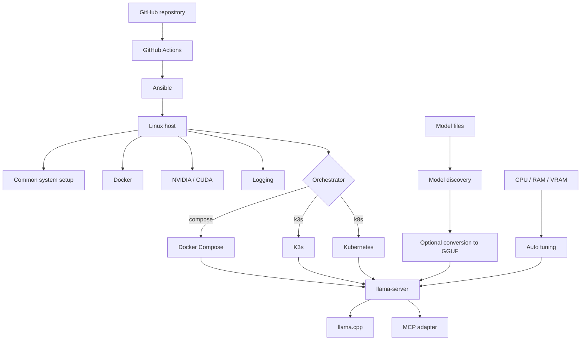
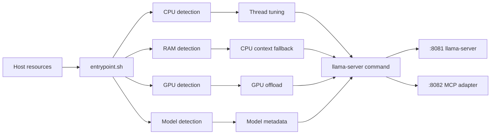
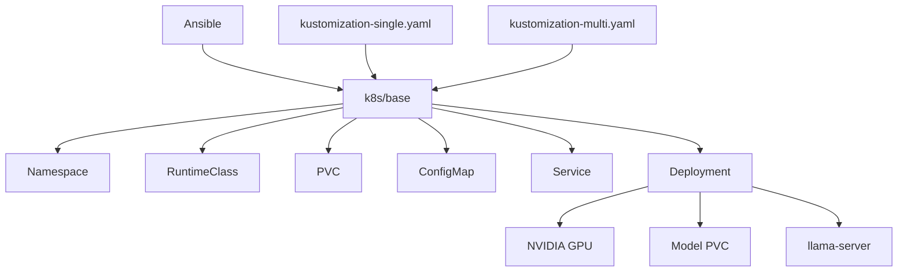

# 🦙 llama-k8s

> Автоматизированное развёртывание и запуск `llama.cpp` на Linux/GPU-инфраструктуре с адаптацией параметров под доступные CPU, RAM и VRAM.


## Содержание

- [О проекте](#-о-проекте)
- [Цель](#-цель)
- [Что умеет проект](#-что-умеет-проект)
- [Архитектура](#-архитектура)
- [Стек технологий](#-стек-технологий)
- [Структура репозитория](#-структура-репозитория)
- [Быстрый запуск](#-быстрый-запуск)
- [Развёртывание через Ansible](#-развёртывание-через-ansible)
- [Конфигурация](#-конфигурация)
- [Автоматическая оптимизация](#-автоматическая-оптимизация)
- [MCP-адаптер](#-mcp-адаптер)
- [Работа с Kubernetes](#-работа-с-kubernetes)
- [CI/CD](#-cicd)
- [Тестирование и проверка](#-тестирование-и-проверка)
- [Git и ветки](#-git-и-ветки)
- [Известные ограничения](#-известные-ограничения)
- [Roadmap](#-roadmap)
- [Лицензия](#-лицензия)

---

## 🧩 О проекте

`llama-k8s` — инфраструктурный проект для автоматизации жизненного цикла локального LLM-сервера на базе [`llama.cpp`](https://github.com/ggml-org/llama.cpp).

Проект объединяет:

- сборку `llama.cpp` с поддержкой CUDA;
- запуск `llama-server` в контейнере;
- автоматическое определение ресурсов хоста;
- вычисление параметров CPU/GPU и контекстного окна;
- автоматизированную подготовку инфраструктуры через Ansible;
- варианты развёртывания через Docker Compose, K3s или Kubernetes;
- Kubernetes manifests с Kustomize overlays;
- опциональный HTTP-адаптер для MCP-подобного интерфейса;
- настройку журналирования и ротации логов;
- GitHub Actions для запуска Ansible-деплоя.

Главная идея проекта — **не задавать все параметры LLM-инференса вручную для каждой машины**, а вычислять базовые значения исходя из фактического железа и доступной памяти.

---

## 🎯 Цель

Цель проекта — получить воспроизводимый pipeline:

```text
Linux host
   │
   ├── CPU / RAM / GPU discovery
   │
   ├── Infrastructure provisioning (Ansible)
   │
   ├── Docker + NVIDIA runtime
   │
   ├── llama.cpp build
   │
   ├── model discovery / optional conversion
   │
   ├── automatic runtime tuning
   │
   └── deployment
        ├── Docker Compose
        ├── K3s
        └── Kubernetes
```

Таким образом, один и тот же репозиторий описывает и инфраструктуру, и контейнер, и параметры запуска модели, и процесс доставки изменений.

---

## ✨ Что умеет проект

### Автоматизация инфраструктуры

Ansible playbook выполняет базовую подготовку хоста, устанавливает Docker, при необходимости настраивает NVIDIA Container Toolkit, настраивает логирование и выбирает оркестратор.

### GPU-aware deployment

Для NVIDIA-хостов учитываются:

- количество GPU;
- общий и свободный объём VRAM;
- возможность offload слоёв модели;
- число реплик в Kubernetes-сценарии.

### Автоматическая настройка `llama-server`

`entrypoint.sh` вычисляет параметры запуска на основании:

- физических и логических CPU;
- L3 cache;
- общего и доступного RAM;
- общего и свободного VRAM;
- размера и метаданных модели.

В частности, автоматически рассчитываются:

- `-ngl`;
- context size;
- batch size;
- `threads`;
- `threads-batch`.

При этом значения можно переопределить через переменные окружения.

### Несколько способов деплоя

Проект содержит логику для:

```text
Compose
K3s
Kubernetes
```

Оркестратор можно выбирать автоматически или задавать явно.

### Работа с моделями

Ansible умеет находить модели в `models_host_path` и предусматривает автоматическую конвертацию не-GGUF моделей в GGUF.

Поддерживаемые расширения, которые рассматриваются playbook'ом для обнаружения:

```text
.gguf
.safetensors
.bin
.onnx
.pt
.pth
```

---

## 🏗 Архитектура

### Общая схема



### Runtime контейнера



### Kubernetes-слой



---

## 🛠 Стек технологий

| Технология | Назначение |
|---|---|
| **Bash** | Entrypoint и автоматическая настройка параметров запуска |
| **Python 3** | MCP HTTP adapter и вспомогательная логика конвертации |
| **llama.cpp** | LLM inference engine |
| **CUDA 12.4** | GPU acceleration |
| **Docker** | Сборка и запуск контейнера |
| **NVIDIA Container Toolkit** | Передача GPU в контейнер |
| **Ansible** | Provisioning и deployment |
| **K3s** | Lightweight Kubernetes deployment |
| **Kubernetes 1.28** | Multi-node orchestration |
| **Kustomize** | Kubernetes overlays |
| **Flask** | HTTP API MCP adapter |
| **requests** | HTTP forwarding в `llama-server` |
| **GitHub Actions** | CI/CD deployment workflow |

Версии, зафиксированные в конфигурации проекта:

| Компонент | Версия / значение |
|---|---|
| CUDA base image | `12.4.0` |
| NVIDIA driver | `550` |
| CUDA toolkit | `12.4` |
| K3s | `v1.28.8+k3s1` |
| Kubernetes packages | `1.28.8` |
| Docker package | `24.0.7` |
| llama.cpp | commit `a0ed91a44` |

---

## 📁 Структура репозитория

```text
llama-k8s/
├── .github/
│   └── workflows/
│       └── deploy.yml
│
├── ansible/
│   ├── ansible.cfg
│   │
│   ├── inventory/
│   │   └── production/
│   │       ├── hosts.ini
│   │       └── group_vars/
│   │           └── all.yml
│   │
│   ├── playbooks/
│   │   ├── site.yml
│   │   └── convert_model.yml
│   │
│   ├── scripts/
│   │   └── convert_model.py
│   │
│   └── roles/
│       ├── common/
│       ├── docker/
│       ├── journald/
│       ├── k3s/
│       ├── k8s/
│       ├── llama-build/
│       ├── llama-deploy/
│       ├── logrotate/
│       └── nvidia/
│
├── Dockerfile
├── docker-compose.yml
├── entrypoint.sh
├── mcp_adapter.py
├── .gitignore
└── README.md
```

### Ответственность директорий

| Каталог / файл | Назначение |
|---|---|
| `Dockerfile` | Локальная сборка CUDA-образа `llama-server` |
| `entrypoint.sh` | Runtime autodetection и запуск `llama-server` |
| `mcp_adapter.py` | HTTP adapter для MCP-style completion API |
| `docker-compose.yml` | Локальный Compose deployment |
| `ansible/playbooks/site.yml` | Главный pipeline развёртывания |
| `ansible/roles/common` | Базовая настройка Linux |
| `ansible/roles/docker` | Docker и NVIDIA runtime |
| `ansible/roles/nvidia` | NVIDIA driver / CUDA |
| `ansible/roles/k3s` | Установка K3s |
| `ansible/roles/k8s` | Установка Kubernetes |
| `ansible/roles/llama-build` | Сборка образа `llama-server-cuda` |
| `ansible/roles/llama-deploy` | Compose/Kubernetes deployment |
| `ansible/roles/logrotate` | Ротация логов |
| `ansible/roles/journald` | Persistent journald и vacuum |
| `.github/workflows/deploy.yml` | GitHub Actions deployment |

---

## 🚀 Быстрый запуск

### Предварительные требования

Для Compose-сценария требуется Linux-хост с NVIDIA GPU и настроенным NVIDIA runtime.

Проверка GPU:

```bash
nvidia-smi
```

Проверка Docker:

```bash
docker --version
docker compose version
```

### 1. Подготовьте модель

По умолчанию контейнер ищет первый файл:

```text
*.gguf
```

в `/models`.

### 2. Соберите образ

```bash
docker build -t llama-server-cuda:latest .
```

### 3. Запустите Compose

Перед запуском при необходимости измените путь к каталогу моделей в `docker-compose.yml`.

```bash
docker compose up -d --build
```

Проверка:

```bash
docker compose ps
docker compose logs -f llama-server
```

### 4. API

`llama-server` публикуется на:

```text
http://localhost:8081
```

MCP adapter:

```text
http://localhost:8082
```

---

## ⚙️ Развёртывание через Ansible

Основной playbook:

```text
ansible/playbooks/site.yml
```

Он:

1. собирает facts;
2. определяет CPU/RAM;
3. проверяет наличие NVIDIA GPU;
4. выбирает orchestrator;
5. ищет модели;
6. при необходимости запускает conversion pipeline;
7. устанавливает инфраструктурные роли;
8. собирает образ `llama-server-cuda`;
9. выполняет deployment.

### Inventory

Файл:

```text
ansible/inventory/production/hosts.ini
```

Группы:

```text
[all]
[k8s_masters]
[k8s_workers]
[gpu_nodes]
[nvidia_hosts]
[llama]
```

IP-адреса `node1` и `node2` читаются из переменных окружения:

```bash
export NODE1_IP=192.168.1.10
export NODE2_IP=192.168.1.11
```

### Запуск

```bash
cd ansible

ansible-playbook \
  -i inventory/production/hosts.ini \
  playbooks/site.yml \
  -e "orchestrator=auto"
```

### Явный выбор orchestrator

Compose:

```bash
ansible-playbook \
  -i inventory/production/hosts.ini \
  playbooks/site.yml \
  -e "orchestrator=compose"
```

K3s:

```bash
ansible-playbook \
  -i inventory/production/hosts.ini \
  playbooks/site.yml \
  -e "orchestrator=k3s"
```

Kubernetes:

```bash
ansible-playbook \
  -i inventory/production/hosts.ini \
  playbooks/site.yml \
  -e "orchestrator=k8s"
```

---

## 🧠 Конфигурация

Глобальные настройки находятся в:

```text
ansible/inventory/production/group_vars/all.yml
```

Основные переменные:

| Переменная | Значение по умолчанию | Назначение |
|---|---|---|
| `project_root` | `/opt/llama-cpp` | Рабочий каталог на хосте |
| `models_host_path` | `/mnt/models` | Каталог моделей |
| `auto_convert` | `true` | Конвертация моделей в GGUF |
| `mcp_enabled` | `true` | Запуск MCP adapter |
| `verbose_logging` | `true` | Подробное логирование |
| `llama_replicas` | `1` | Количество реплик |
| `llama_memory_limit` | `8Gi` | Memory limit |
| `llama_cpu_limit` | `4` | CPU limit |

Переменные можно переопределять через environment variables.

Примеры:

```bash
export ORCHESTRATOR=k3s
export MODEL_NAME=my-model.gguf
export MCP_ENABLED=true
export AUTO_CONVERT=true
export LLAMA_MEMORY_LIMIT=16Gi
export LLAMA_CPU_LIMIT=8
export LLAMA_REPLICAS=2
```

---

## 🔬 Автоматическая оптимизация

Одной из центральных частей проекта является `entrypoint.sh`.

### CPU

Скрипт определяет:

```text
physical cores
logical cores
L3 cache
```

На их основе вычисляются:

```text
THREADS
THREADS_BATCH
```

При большем L3 cache используется более агрессивная рекомендация количества worker threads.

### GPU

Определяются:

```text
GPU_TOTAL
GPU_USED
GPU_FREE
```

Затем из доступной VRAM вычитается safety margin:

```text
VRAM_SAFETY=200 MiB
```

После этого рассчитывается примерное количество слоёв для offload:

```text
NGL
```

При достаточном объёме VRAM используется:

```text
NGL=99
```

### Context size

Context рассчитывается исходя из памяти, оставшейся после оценки GPU offload.

Ограничения:

```text
GPU path: 512 ... 16384
CPU path: 512 ... 8192
```

### Batch

Базовое значение:

```text
512  — при GPU > 6000 MiB
256  — иначе
```

### Другие параметры

По умолчанию включаются:

```text
FLASH_ATTN=on
CACHE_TYPE_K=q4_0
CACHE_TYPE_V=q4_0
PARALLEL=1
--cont-batching
--mlock
```

Все вычисленные параметры печатаются в логах перед стартом `llama-server`.

---

## 🔌 MCP-адаптер

`mcp_adapter.py` — небольшой Flask-сервис, который работает как HTTP-слой перед `llama-server`.

### Endpoint

```http
POST /complete
```

Минимальное тело:

```json
{
  "prompt": "Hello, llama!"
}
```

Параметры:

```json
{
  "prompt": "Hello, llama!",
  "max_tokens": 512,
  "temperature": 0.7,
  "stop": []
}
```

Adapter преобразует запрос в формат `llama-server`:

```text
client
  │
  ▼
:8082 /complete
  │
  ▼
:8081 /completion
  │
  ▼
llama.cpp
```

Проверка health endpoint:

```bash
curl http://localhost:8082/health
```

Ожидаемый ответ:

```json
{"status":"ok"}
```

---

## ☸️ Работа с Kubernetes

Для Kubernetes создаются:

```text
namespace
runtime class
persistent volume claim
config map
service
deployment
```

Базовые manifests находятся в:

```text
ansible/roles/llama-deploy/templates/
```

### Single-node

Используется:

```text
overlays/single-node
```

и устанавливает:

```text
replicas = 1
```

### Multi-node

Используется:

```text
overlays/multi-node
```

Количество реплик определяется переменной:

```text
llama_replicas
```

При отсутствии override playbook стремится использовать число GPU как число реплик:

```text
GPU count > 0  → replicas = GPU count
GPU count = 0  → replicas = 1
```

### GPU runtime

Deployment использует:

```yaml
runtimeClassName: nvidia
```

и запрашивает:

```yaml
nvidia.com/gpu: 1
```

---

## 🔄 CI/CD

GitHub Actions workflow:

```text
.github/workflows/deploy.yml
```

### Автоматический запуск

Workflow запускается на:

```text
push → main
```

### Ручной запуск

Поддерживается `workflow_dispatch` с параметрами:

| Параметр | Назначение |
|---|---|
| `orchestrator` | `compose`, `k3s` или `k8s` |
| `models_list` | Список моделей через запятую |
| `auto_convert` | Автоматическая конвертация |

### Pipeline


Для подключения используются GitHub Secrets:

```text
SSH_PRIVATE_KEY
VPS_IP
```

---

## 🧪 Тестирование и проверка

В текущей версии репозитория отдельного автоматического test suite (`pytest`, integration tests и т. п.) нет. Поэтому проверка выполняется как **infrastructure/smoke validation**.

### Проверка контейнера

```bash
docker compose ps
```

```bash
docker compose logs llama-server
```

### Проверка GPU внутри контейнера

```bash
docker exec -it llama-server nvidia-smi
```

### Проверка основного HTTP-сервера

```bash
curl http://localhost:8081
```

### Проверка MCP adapter

```bash
curl http://localhost:8082/health
```

### Проверка Kubernetes

```bash
kubectl get nodes
```

```bash
kubectl get pods -n llama
```

```bash
kubectl get svc -n llama
```

```bash
kubectl get deployment -n llama
```

### Проверка Ansible

Для диагностического запуска:

```bash
ansible-playbook \
  -i inventory/production/hosts.ini \
  playbooks/site.yml \
  -e "orchestrator=auto" \
  -v
```

### Что следует проверять перед merge/deploy

```text
[ ] Ansible playbook проходит без fatal errors
[ ] Docker image собирается
[ ] NVIDIA GPU доступна контейнеру
[ ] модель обнаруживается
[ ] llama-server стартует
[ ] :8081 доступен
[ ] :8082 доступен при MCP_ENABLED=1
[ ] Kubernetes pods переходят в Running
[ ] Deployment получает GPU resource
```

---

## 🌿 Git и ветки

На момент подготовки документации в репозитории присутствуют:

```text
main
dev
```

Также зафиксирован tag:

```text
v0.0.1
```

### Назначение веток

| Ветка | Назначение |
|---|---|
| `main` | Стабильное состояние и источник production deployment |
| `dev` | Основная ветка текущей разработки |

GitHub Actions настроен на автоматический deployment только из:

```text
main
```

### Рекомендуемый workflow

Новые изменения лучше вести в отдельных feature-ветках:

```bash
git checkout dev
git pull

git checkout -b feature/<name>
```

После завершения:

```bash
git push -u origin feature/<name>
```

Далее:

```text
feature/*
   ↓
Pull Request
   ↓
dev
   ↓
проверка
   ↓
main
   ↓
deployment
```

Так production-ветка не смешивается с незавершённой разработкой.

---

## ⚠️ Известные ограничения

Этот раздел намеренно отражает **текущее состояние репозитория**, а не предполагаемое.

### 1. Конвертация моделей: имя файла скрипта не совпадает

В репозитории находится:

```text
ansible/scripts/convert_model.py
```

но `convert_model.yml` и роль `llama-build` ссылаются на:

```text
scripts/convert_models.py
```

То есть текущий automation path для model conversion требует синхронизации имён.

### 2. `model_info.py` отсутствует в репозитории

`entrypoint.sh` предусматривает использование:

```text
/app/model_info.py
```

для получения metadata модели, однако этот файл отсутствует в текущем tree.

Поэтому предусмотрен fallback на приблизительные значения.

### 3. Kubernetes PVC не содержит описанного PV

В manifest присутствует:

```text
models-pvc
```

с `ReadOnlyMany`, но отдельный `PersistentVolume` в репозитории не описан.

Фактическое создание volume поэтому зависит от конфигурации storage на целевом Kubernetes-кластере.

### 4. K3s-конфигурация сейчас ориентирована на серверный режим

В роли K3s устанавливается server с:

```text
--disable-agent
```

При этом отдельный worker join workflow для K3s в текущем репозитории не реализован.

### 5. CUDA architecture зафиксирована

Docker build использует:

```text
DLLAMA_CUDA_ARCH=89
```

то есть образ ориентирован на соответствующую CUDA compute capability, а не на универсальную автоматическую сборку под все GPU.

### 6. Compose-файл для локального запуска содержит machine-specific model path

В корневом `docker-compose.yml` указан конкретный host path:

```text
/home/k3rnel_co0n/llama.cpp/models
```

Для другого хоста этот путь необходимо изменить.

---

## 🗺 Roadmap

План дальнейшего развития проекта может включать:

- [ ] унифицировать `convert_model.py` / `convert_models.py`;
- [ ] вынести получение model metadata в отдельный стабильный модуль;
- [ ] добавить автоматические smoke/integration tests;
- [ ] сделать storage provision для Kubernetes;
- [ ] завершить полноценный multi-node K3s workflow;
- [ ] сделать CUDA architecture configurable вместо фиксированного `89`;
- [ ] убрать machine-specific paths из root Compose;
- [ ] добавить health/readiness probes для Kubernetes;
- [ ] добавить более строгую валидацию входных параметров;
- [ ] разделить secrets и deployment configuration;
- [ ] добавить release workflow и changelog.

---

## 📄 Лицензия

В текущем репозитории файл лицензии представлен MIT LICENSE.
