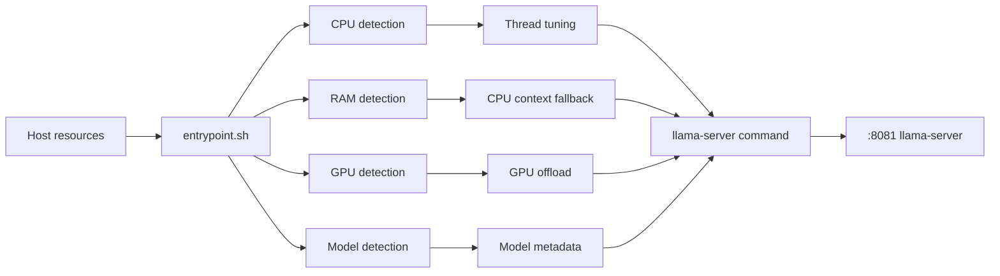
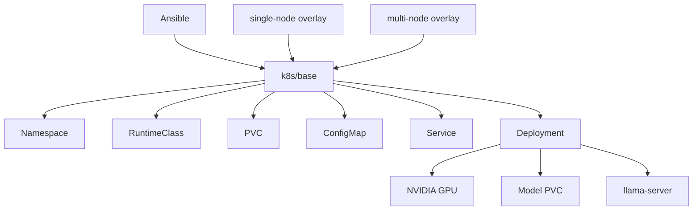

# 🦙 llama-k8s

> Автоматизированный deployment pipeline для локального LLM inference на Linux/GPU-инфраструктуре с `llama.cpp`, NVIDIA/CUDA, Ansible, Docker Compose, K3s и Kubernetes.

[](https://github.com/zackshal/llama-k8s/tree/dev)
[](https://github.com/zackshal/llama-k8s/releases/tag/v0.0.1)
[](LICENSE)
[](https://developer.nvidia.com/cuda-toolkit)
[](https://kubernetes.io/)

---

## 📌 О проекте

`llama-k8s` — инфраструктурный проект для автоматизации развёртывания и запуска локальных LLM на Linux-хостах с NVIDIA GPU.

Проект связывает в единый pipeline обнаружение hardware, подготовку хоста, сборку CUDA-образа с `llama.cpp`, поиск/конвертацию моделей, runtime auto-tuning и deployment через Docker Compose, K3s или Kubernetes.

Ключевой принцип:

> **Infrastructure first, model second.**

Модель не должна требовать ручного подбора всех inference-параметров под каждую машину. Runtime определяет доступные CPU, RAM, GPU/VRAM и характеристики модели, после чего выбирает разумную стартовую конфигурацию.

---

## 🎯 Цель

Получить воспроизводимый deployment pipeline:

```text
Linux host
    │
    ├── CPU / RAM / GPU discovery
    ├── Ansible provisioning
    ├── Docker + NVIDIA runtime
    ├── llama.cpp CUDA build
    ├── Model discovery
    │       └── optional conversion → GGUF
    ├── Runtime auto-tuning
    │       ├── threads
    │       ├── context
    │       ├── batch
    │       └── GPU offload
    └── Deployment
            ├── Docker Compose
            ├── K3s
            └── Kubernetes
```

Таким образом, один репозиторий описывает инфраструктуру, контейнер, параметры запуска модели и доставку изменений.

---

## ✨ Возможности

### ⚙️ Infrastructure provisioning

Ansible выполняет:

- сбор facts;
- определение CPU/RAM;
- обнаружение NVIDIA GPU;
- установку Docker;
- настройку NVIDIA runtime;
- установку K3s или Kubernetes;
- настройку journald и logrotate;
- сборку inference image;
- deployment.

### 🧠 GPU-aware inference

Учитываются количество GPU, общий/свободный объём VRAM, доступная RAM, CPU topology, L3 cache и размер/metadata модели.

### 🔬 Runtime auto-tuning

`entrypoint.sh` рассчитывает:

- `NGL` / GPU offload;
- context size;
- batch size;
- `threads`;
- `threads-batch`.

Параметры можно переопределять через environment variables.

### 📦 Model discovery & conversion

Playbook ищет модели в `models_host_path` и предусматривает conversion pipeline в GGUF. Распознаются:

```text
.gguf
.safetensors
.bin
.onnx
.pt
.pth
```

### ☸️ Kubernetes

Поддерживаются single-node и multi-node сценарии, Kustomize overlays, NVIDIA RuntimeClass, GPU resource requests, PVC для моделей и стандартный набор Kubernetes resources.

### 🔌 HTTP / MCP-style adapter

`mcp_adapter.py` предоставляет Flask HTTP-слой перед `llama-server`:

```text
client
  │
  ▼
:8082 /complete
  │
  ▼
:8081 /completion
  │
  ▼
llama.cpp
```

### 🔄 CI/CD

`.github/workflows/deploy.yml` запускает deployment после `push` в `main` и поддерживает ручной `workflow_dispatch` с выбором orchestrator, моделей и conversion.

---

# 🏗 Архитектура

## Общая схема


## Runtime контейнера



## Kubernetes layer



---

# 🧩 Технологический стек

| Технология | Назначение |
|---|---|
| **Bash** | runtime detection и запуск контейнера |
| **Python 3** | HTTP adapter и model conversion helpers |
| **llama.cpp** | inference engine |
| **CUDA 12.4** | GPU acceleration |
| **Docker** | сборка и запуск inference image |
| **NVIDIA Container Toolkit** | передача GPU в контейнер |
| **Ansible** | provisioning и deployment |
| **K3s** | lightweight Kubernetes deployment |
| **Kubernetes 1.28** | orchestration |
| **Kustomize** | overlays |
| **Flask** | HTTP adapter |
| **requests** | forwarding в `llama-server` |
| **GitHub Actions** | CI/CD |

### Зафиксированные версии

| Компонент | Версия / значение |
|---|---|
| CUDA base image | `12.4.0` |
| NVIDIA driver target | `550` |
| CUDA toolkit | `12.4` |
| K3s | `v1.28.8+k3s1` |
| Kubernetes packages | `1.28.8` |
| Docker package | `24.0.7` |
| llama.cpp | commit `a0ed91a44` |

---

# 📁 Структура репозитория

```text
llama-k8s/
├── .github/
│   └── workflows/
│       └── deploy.yml
│
├── ansible/
│   ├── ansible.cfg
│   ├── inventory/
│   │   └── production/
│   │       ├── hosts.ini
│   │       └── group_vars/
│   │           └── all.yml
│   ├── playbooks/
│   │   ├── site.yml
│   │   └── convert_model.yml
│   ├── scripts/
│   │   └── convert_model.py
│   └── roles/
│       ├── common/
│       ├── docker/
│       ├── journald/
│       ├── k3s/
│       ├── k8s/
│       ├── llama-build/
│       ├── llama-deploy/
│       ├── logrotate/
│       └── nvidia/
│
├── Dockerfile
├── docker-compose.yml
├── entrypoint.sh
├── mcp_adapter.py
├── .gitignore
└── README.md
```

| Компонент | Ответственность |
|---|---|
| `Dockerfile` | CUDA image и сборка `llama-server` |
| `entrypoint.sh` | resource discovery и auto-tuning |
| `mcp_adapter.py` | HTTP adapter |
| `docker-compose.yml` | локальный Compose deployment |
| `ansible/playbooks/site.yml` | основной deployment pipeline |
| `ansible/playbooks/convert_model.yml` | model conversion workflow |
| `ansible/scripts/convert_model.py` | conversion helper |
| `roles/common` | базовая настройка Linux |
| `roles/docker` | Docker / runtime |
| `roles/nvidia` | NVIDIA configuration |
| `roles/k3s` | K3s |
| `roles/k8s` | Kubernetes |
| `roles/llama-build` | build inference image |
| `roles/llama-deploy` | Compose / Kubernetes deployment |
| `roles/logrotate` | log rotation |
| `roles/journald` | persistent journald / vacuum |

---

# 🚀 Быстрый запуск

## Требования

Для Compose нужен Linux-хост с NVIDIA GPU и рабочим NVIDIA runtime.

```bash
nvidia-smi
docker --version
docker compose version
```

Для Kubernetes:

```bash
kubectl version --client
```

## 1. Подготовьте модель

Контейнер по умолчанию ищет первый `*.gguf` в `/models`. В Compose сопоставьте этот каталог с host directory с моделями.

## 2. Соберите image

```bash
docker build -t llama-server-cuda:latest .
```

## 3. Запустите Compose

```bash
docker compose up -d --build
docker compose ps
docker compose logs -f llama-server
```

## 4. Проверьте GPU

```bash
docker exec -it llama-server nvidia-smi
```

## 5. Проверьте API

```bash
curl http://localhost:8081
curl http://localhost:8082/health
```

Для adapter ожидается:

```json
{"status":"ok"}
```

---

# ⚙️ Развёртывание через Ansible

Основной playbook:

```text
ansible/playbooks/site.yml
```

Pipeline:

```text
facts
  ↓
CPU / RAM / GPU discovery
  ↓
orchestrator selection
  ↓
model discovery
  ↓
optional conversion
  ↓
infrastructure roles
  ↓
llama image build
  ↓
deployment
```

## Inventory

```text
ansible/inventory/production/hosts.ini
```

Группы:

```text
[all]
[k8s_masters]
[k8s_workers]
[gpu_nodes]
[nvidia_hosts]
[llama]
```

IP-адреса `node1` и `node2` задаются через environment variables:

```bash
export NODE1_IP=192.168.1.10
export NODE2_IP=192.168.1.11
```

## Автоматический выбор orchestrator

```bash
cd ansible
ansible-playbook \
  -i inventory/production/hosts.ini \
  playbooks/site.yml \
  -e "orchestrator=auto"
```

Явный выбор:

```bash
# Compose
ansible-playbook -i inventory/production/hosts.ini playbooks/site.yml -e "orchestrator=compose"

# K3s
ansible-playbook -i inventory/production/hosts.ini playbooks/site.yml -e "orchestrator=k3s"

# Kubernetes
ansible-playbook -i inventory/production/hosts.ini playbooks/site.yml -e "orchestrator=k8s"
```

---

# 🔧 Конфигурация

Основные настройки:

```text
ansible/inventory/production/group_vars/all.yml
```

| Переменная | Default | Назначение |
|---|---:|---|
| `project_root` | `/opt/llama-cpp` | рабочий каталог |
| `models_host_path` | `/mnt/models` | каталог моделей |
| `auto_convert` | `true` | конвертация моделей |
| `mcp_enabled` | `true` | запуск adapter |
| `verbose_logging` | `true` | подробные логи |
| `llama_replicas` | `1` | количество replicas |
| `llama_memory_limit` | `8Gi` | memory limit |
| `llama_cpu_limit` | `4` | CPU limit |

Пример:

```bash
export ORCHESTRATOR=k3s
export MODEL_NAME=my-model.gguf
export MCP_ENABLED=true
export AUTO_CONVERT=true
export LLAMA_MEMORY_LIMIT=16Gi
export LLAMA_CPU_LIMIT=8
export LLAMA_REPLICAS=2
```

---

# 🔬 Автоматическая оптимизация

`entrypoint.sh` — центральный runtime-компонент.

### CPU

Определяются:

```text
physical cores
logical cores
L3 cache
```

На их основе выбираются:

```text
THREADS
THREADS_BATCH
```

### GPU

Определяются:

```text
GPU_TOTAL
GPU_USED
GPU_FREE
```

Из свободной VRAM вычитается safety margin:

```text
VRAM_SAFETY = 200 MiB
```

После этого оценивается `NGL`. При достаточной VRAM используется:

```text
NGL = 99
```

### Context

Диапазоны:

```text
GPU: 512 ... 16384
CPU: 512 ... 8192
```

### Batch

```text
GPU > 6000 MiB → 512
иначе          → 256
```

### Runtime defaults

```text
FLASH_ATTN=on
CACHE_TYPE_K=q4_0
CACHE_TYPE_V=q4_0
PARALLEL=1
--cont-batching
--mlock
```

Рассчитанные параметры выводятся в лог перед запуском `llama-server`.

---

# 🔌 HTTP / MCP-style adapter

Файл:

```text
mcp_adapter.py
```

Endpoint:

```http
POST /complete
```

Минимальный запрос:

```json
{
  "prompt": "Hello, llama!"
}
```

Поддерживаемые параметры:

```json
{
  "prompt": "Hello, llama!",
  "max_tokens": 512,
  "temperature": 0.7,
  "stop": []
}
```

Health check:

```bash
curl http://localhost:8082/health
```

---

# ☸️ Kubernetes

Проект предусматривает:

```text
Namespace
RuntimeClass
PersistentVolumeClaim
ConfigMap
Service
Deployment
```

Базовые templates находятся в:

```text
ansible/roles/llama-deploy/templates/
```

### Single-node

```text
overlays/single-node
```

```text
replicas = 1
```

### Multi-node

```text
overlays/multi-node
```

Количество replicas задаётся `llama_replicas`. Если override отсутствует, используется число GPU как ориентир:

```text
GPU count > 0 → replicas = GPU count
GPU count = 0 → replicas = 1
```

GPU runtime:

```yaml
runtimeClassName: nvidia
```

GPU resource:

```yaml
resources:
  limits:
    nvidia.com/gpu: 1
```

---

# 🔄 CI/CD

Workflow:

```text
.github/workflows/deploy.yml
```

Автоматический запуск:

```text
push → main
```

Manual workflow (`workflow_dispatch`) поддерживает:

| Input | Значения |
|---|---|
| `orchestrator` | `compose`, `k3s`, `k8s` |
| `models_list` | список моделей через запятую |
| `auto_convert` | включить / выключить conversion |

Pipeline:


Secrets:

```text
SSH_PRIVATE_KEY
VPS_IP
```

---

# 🧪 Тестирование и smoke validation

Отдельного `pytest`/integration test suite в текущей версии нет. Поэтому перед merge/deploy используется infrastructure smoke validation.

### Docker

```bash
docker compose ps
docker compose logs llama-server
```

### GPU

```bash
docker exec -it llama-server nvidia-smi
```

### llama-server

```bash
curl http://localhost:8081
```

### MCP adapter

```bash
curl http://localhost:8082/health
```

### Kubernetes

```bash
kubectl get nodes
kubectl get pods -n llama
kubectl get svc -n llama
kubectl get deployment -n llama
```

### Ansible

```bash
ansible-playbook \
  -i inventory/production/hosts.ini \
  playbooks/site.yml \
  -e "orchestrator=auto" \
  -v
```

### Checklist

```text
[ ] Ansible playbook проходит без fatal errors
[ ] Docker image собирается
[ ] NVIDIA GPU доступна контейнеру
[ ] модель обнаруживается
[ ] llama-server стартует
[ ] :8081 доступен
[ ] :8082 доступен при включённом MCP
[ ] Kubernetes pods переходят в Running
[ ] Deployment получает GPU resource
```

---

# 🌿 Git workflow

Текущие основные ветки:

```text
main
 dev
```

Также присутствует tag:

```text
v0.0.1
```

| Ветка | Назначение |
|---|---|
| `main` | стабильное состояние и источник deployment |
| `dev` | текущая разработка |

Рекомендуемый workflow:

```bash
git checkout dev
git pull
git checkout -b feature/<name>
```

После завершения:

```bash
git add .
git commit -m "feat: <description>"
git push -u origin feature/<name>
```

Затем:

```text
feature/*
    ↓
Pull Request
    ↓
dev
    ↓
validation
    ↓
main
    ↓
deployment
```

---

# ⚠️ Известные ограничения

Этот раздел отражает именно текущее состояние репозитория.

### 1. Model conversion entrypoint

В tree находится:

```text
ansible/scripts/convert_model.py
```

при этом отдельные части automation path ссылаются на:

```text
scripts/convert_models.py
```

Имена нужно синхронизировать перед тем, как считать conversion pipeline полностью воспроизводимым.

### 2. Model metadata

`entrypoint.sh` предусматривает `/app/model_info.py`, но отдельного `model_info.py` в текущем tree нет. Поэтому используется fallback-логика.

### 3. Kubernetes storage

Используется `models-pvc` с `ReadOnlyMany`, но отдельный PV в репозитории не описан. Фактический storage зависит от конфигурации целевого кластера.

### 4. K3s

Текущая role ориентирована на server mode и использует `--disable-agent`. Полноценный отдельный worker join workflow не реализован.

### 5. CUDA architecture

Docker build использует:

```text
DLLAMA_CUDA_ARCH=89
```

Поэтому текущий image не является универсальным build для всех NVIDIA GPU.

### 6. Machine-specific Compose path

Корневой `docker-compose.yml` содержит конкретный host path для каталога моделей. На другой машине mapping потребуется изменить.

---

# 🗺 Roadmap

```text
[x] Docker + CUDA inference image
[x] CPU/RAM/GPU discovery
[x] Runtime auto-tuning
[x] Ansible provisioning
[x] Compose deployment
[x] K3s deployment path
[x] Kubernetes manifests
[x] Single-node / multi-node overlays
[x] HTTP adapter
[x] CI/CD deployment
[ ] unify model conversion entrypoints
[ ] stable model metadata module
[ ] automated smoke / integration tests
[ ] Kubernetes storage provisioning
[ ] full multi-node K3s workflow
[ ] configurable CUDA architecture
[ ] remove machine-specific Compose paths
[ ] Kubernetes health/readiness probes
[ ] stricter configuration validation
[ ] dedicated secrets/config separation
[ ] release workflow + changelog
```

---

# 🔭 Архитектурное направление

Текущая архитектура специально разделяет deployment/inference слой и позволяет подключать внешний control plane без превращения `llama-k8s` в монолит:

```text
┌─────────────────────────────────────┐
│          Control / API layer        │
└──────────────────┬──────────────────┘
                   │
                   ▼
┌─────────────────────────────────────┐
│         Model / inference layer     │
│                                     │
│       llama-server → model runtime  │
└──────────────────┬──────────────────┘
                   │
                   ▼
┌─────────────────────────────────────┐
│        Orchestration layer          │
│                                     │
│ Docker Compose / K3s / Kubernetes   │
└──────────────────┬──────────────────┘
                   │
                   ▼
┌─────────────────────────────────────┐
│       Infrastructure layer          │
│                                     │
│ Linux / CPU / RAM / GPU / storage   │
└─────────────────────────────────────┘
```

---

# 🤝 Основная инженерная задача

`llama-k8s` исследует практическую задачу:

> **Как автоматически развернуть локальный LLM inference workload на разном Linux/GPU hardware, минимизируя ручную конфигурацию и сохраняя единый deployment workflow?**

Поэтому основной фокус проекта — не создание собственной LLM, а эксплуатация inference infrastructure:

- provisioning;
- containers;
- GPU runtime;
- resource-aware tuning;
- model lifecycle;
- orchestration;
- deployment automation.

---

# 📄 Лицензия

Проект распространяется под лицензией **MIT**. См. [LICENSE](LICENSE).
